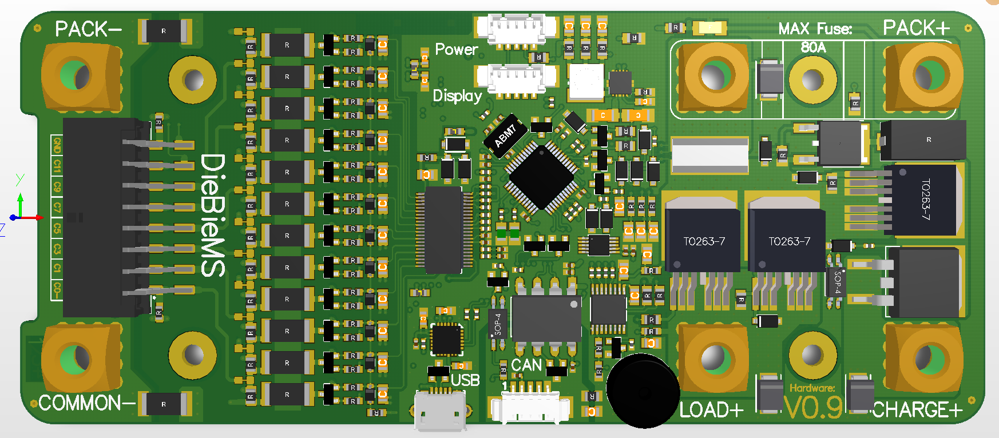
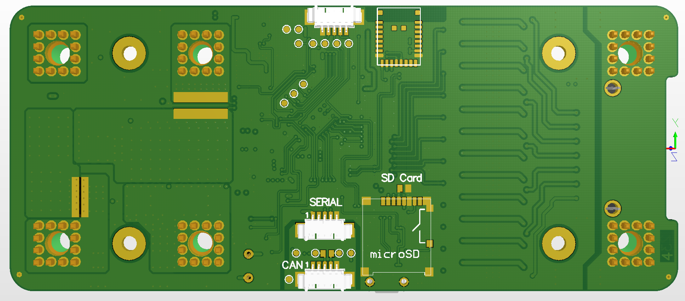
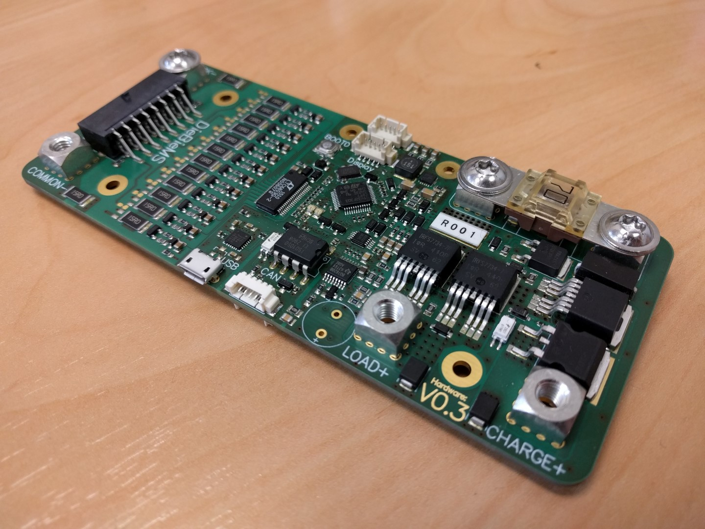
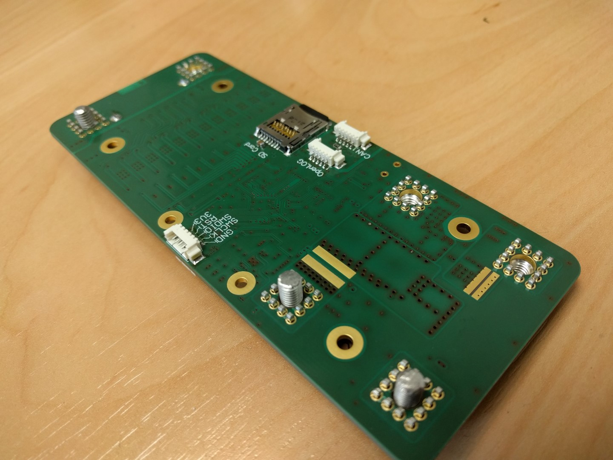
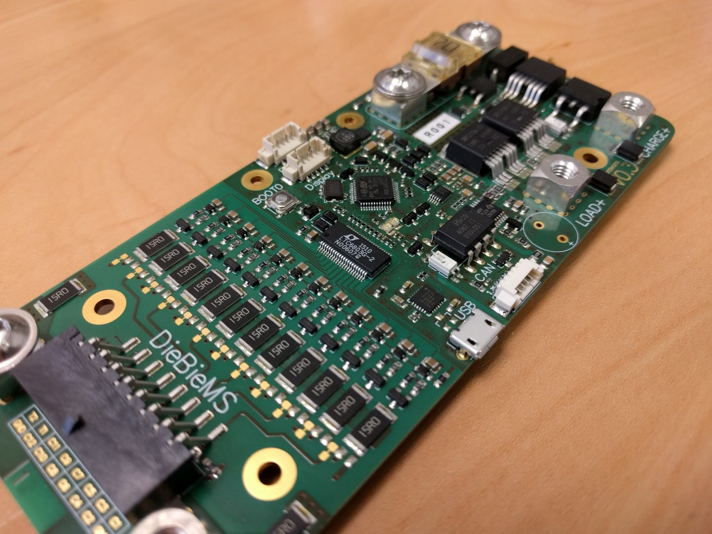
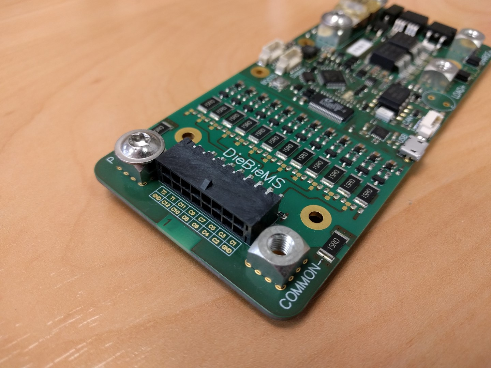

DieBieMS - Hardware
===
# Introduction
My personal transportation environment is becoming more and more electrical. All my new vehicles so far contain Lithium based batteries and need some form of automated management to be utilized in a safe and easy way. All affordable alternatives that I could find were either to dangerous(extreme cell voltage limits), couldn't carry the desired current (>70A), not compact enough or were not customizable. With this fully opensource project I would like to contribute to a more safe and affordable Lithium based electric vehicle (or possible other usage) future.

### Other parts of this project
This is the hardware repository containing all hardware source files (designed in altium) and the project outputs to build a BMS PCB. There are three more repositories for this project:\
[DieBieMS Firmware](https://github.com/DieBieEngineering/DieBieMS-Firmware) has to be flashed to the empty BMS STM32, the build .bin and hex file can be found in the BMS tool [resource folder](https://github.com/DieBieEngineering/DieBieMS-Tool/tree/master/res/firmwares).\
[DieBieMS Bootloader](https://github.com/DieBieEngineering/DieBieMS-Bootloader) can be flashed with the BMS Tool in the firmware tab.\
[DieBieMS Configuration tool](https://github.com/DieBieEngineering/DieBieMS-Tool) the tool to configure the BMS and upload the bootloader / update the main firmware.\

### Latest hardware release (production files)
Production data for most recent version can be found [here](Project%20Outputs%20for%20DB10005_DieBieMS). The initial project blog/log can be found [here](http://www.electric-skateboard.builders/t/diy-6s-to-12s-bms-with-can/2639). And the schematic in PDF [here](Project%20Outputs%20for%20DB10005_DieBieMS/DB10005_DieBieMS.PDF).

### Features
This BMS is an all in one solution, combined with a lithium battery it is possible to replace an existing lead based battery pack (ideal for upgrading a bulky and heavy electric scooter with a much lighter li-polymer pack). In order to be a plug and play system the BMS carries all power electronics and controller systems to switch the main power path and communicate with external interfaces (displays, buttons or anything else you adapt to it). A small list of features:

* Soft power switch input with LED (LOAD) on/off + charge indicator.
* High side power switching to allow all grounds to remain connected at all times.
* Charge input -> switched (high side) -> to charger output (to disable charger if a cell reaches the max cell voltage).
* Charge input has optional input diode to eliminate current leakage or power on exposed pins (like the male charge connector). V0.10 is an experimental version that has a P-FET instead of the diode to limit heat production when charging.
* Discharge input -> switched (high side)-> to LOAD e.i. motor controller / VESC (to disable the load when a cell reaches the min voltage).
* Isolated CAN bus interface for cell voltage monitoring and charger detection, status monitoring + much more with future updates (like state of charge / state of health).
* Pack current sensing (bi-directional).
* Pre charge for high capacitive load (with shortcircuit detection, in case the motor controller is shorted / dead / wrong polarity).
* USB interface for serial communication and firmware upgrades (no need for a programmer -> HW serial bootloader is used).
* Buzzer to indicate possible Error state.
* Compact footprint

### Electrical specifications
* Max load current +/- 100A for a short time, for long it is about 70A.
* Max charge current 10A (with diode) or 30A (with diode bypass).
* Cell voltage range 2.5V to 4.5V.
* Pack voltage 12V to 54V

# Realisation
Out of the many ways to realise an all in one BMS I chose the more simple but maybe more expensive way. Since there is a lot of desired functionality and the need for a small footprint many features are realized by complex chips.

#### Power-on state management
There are several ways to enable the BMS and put it into the corresponding operation mode. As of now the following modes of operation are present:
* Normal operation

   This mode is triggered by a single pres on the powerbutton, when the button is released the microcontroller keeps the BMS on. A long pres will powerdown the BMS. The LED turns solid on when enabled and turn off when powerdown long buttonpress is detected.
* Charging mode

   When the CHARGE+ input is brought >3V above the PACK+ terminal the BMS is booting into charge mode, the microcontroller will check the cell voltages and if desired enable the switch to allow current to flow from CHARGE+ to PACK+. In this mode the microcontroller knows the presence of the charge. If the charger is removed the microcontroller will keep the BMS on for a configurable amount of time to display a status message (show for example the charged amount) followed by powering down.
* External mode

   When a USB cable is connected or 5V is applied on the CAN connector the BMS will boot into external power mode. Firmware updating trough the hardware bootloader or communication over CAN bus is now possible. The power on enable by CAN functionality allows an externally battery powered telemetry device to enable the BMS and request battery pack data (giving for example daily / weekly / monthly status updates).

#### Used technology
The IC's used with their corresponding functionality:
* LTC6803-2 -> Battery stack cell voltage monitor.
* STM32F303 -> Main microcontroller.
* ISL28022 -> Pack voltage and current measurement.
* BQ76200 -> Height side FET driver for LOAD+ CHARGE+ and Pre-charge switch driving.
* LM5165 -> SMPS Buck converter, converting the pack voltage to +3.3V.
* ISO1050 -> isolated CAN-Bus transceiver.
* CP2104-F03 -> USB to serial converter for bootloader based firmware updates and debugging.

